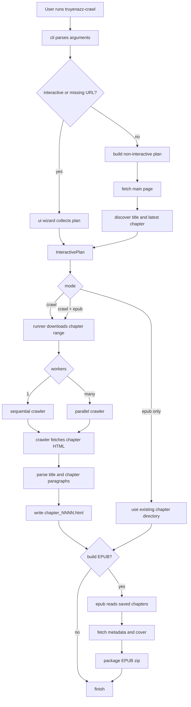

# truyenazz-crawler

Rust command-line crawler for truyenazz novels. It downloads chapter ranges as
clean local HTML files and can package those saved chapters into an EPUB with
metadata, cover image, and embedded font support.

## Features

- Crawl one chapter or a chapter range from a truyenazz novel URL.
- Automatically discover the latest available chapter when `--end` is omitted.
- Save chapters under a per-novel output directory as `chapter_NNNN.html`.
- Build an EPUB from newly crawled chapters or from an existing chapter folder.
- Run sequentially or with multiple download workers.
- Choose how to handle existing chapter files: ask, skip, or overwrite.
- Use an interactive TUI wizard with live download and EPUB build screens.
- Build release binaries for Linux, Windows, macOS Intel, and macOS ARM through GitHub Actions.

## Requirements

- Rust stable toolchain
- Network access to fetch novel pages and cover images

## Quick Start

```sh
cargo build --release
```

Run the binary from Cargo:

```sh
cargo run -- "https://truyenazz.me/your-novel" --start 1 --end 10
```

Or run the compiled binary:

```sh
./target/release/truyenazz-crawl "https://truyenazz.me/your-novel" --start 1 --end 10
```

Output is written to `output/<novel-slug>/chapter_NNNN.html` by default.

## Common Commands

Start the interactive wizard:

```sh
cargo run -- --interactive
```

Crawl chapters and build an EPUB:

```sh
cargo run -- "https://truyenazz.me/your-novel" --start 1 --end 50 --epub
```

Let the crawler discover the latest chapter:

```sh
cargo run -- "https://truyenazz.me/your-novel" --start 1 --epub
```

Use four parallel workers and skip files that already exist:

```sh
cargo run -- "https://truyenazz.me/your-novel" --start 1 --end 100 --workers 4 --if-exists skip
```

Build an EPUB from an existing chapter directory:

```sh
cargo run -- "https://truyenazz.me/your-novel" --epub-only --chapter-dir output/your_novel
```

Embed a custom font in the EPUB:

```sh
cargo run -- "https://truyenazz.me/your-novel" --epub --font-path /path/to/font.ttf
```

## CLI Options

```text
truyenazz-crawl [OPTIONS] [BASE_URL]

Options:
  --start <N>              Start chapter number, inclusive
  --end <N>                End chapter number, inclusive
  --output-root <DIR>      Root output directory [default: output]
  --delay <SECONDS>        Delay between sequential requests [default: 0.5]
  --workers <N>            Number of concurrent download workers [default: 1]
  --epub                   Build an EPUB after crawling
  --epub-only              Build an EPUB from existing saved chapter files
  --chapter-dir <DIR>      Existing chapter directory for --epub-only
  --font-path <FILE>       Font file to embed instead of the bundled font
  --if-exists <POLICY>     ask, skip, or overwrite [default: ask]
  --fast-skip              Skip remote checks when the destination file already exists
  -i, --interactive        Launch the interactive TUI
  -h, --help               Show help
  -V, --version            Show version
```

`--workers > 1` requires `--if-exists skip` or `--if-exists overwrite`, because
interactive per-file prompts are only safe in the sequential path.

## How It Works



## Code Layout

- `src/cli.rs`: argument parsing and option validation.
- `src/bin/truyenazz-crawl.rs`: process entry point and top-level orchestration.
- `src/crawler/`: chapter HTML fetching, parsing, latest-chapter discovery, and file writes.
- `src/runner.rs`: sequential and parallel chapter runners with progress events.
- `src/epub/`: metadata extraction, saved-chapter reading, EPUB XML/XHTML generation, and archive writing.
- `src/ui/`: interactive TUI widgets, screens, wizard state, and plan summary.
- `src/utils.rs`: shared URL, filesystem, text-cleaning, and slug helpers.
- `src/font.rs`: embedded font metadata extraction.

## Testing

Run the full test suite:

```sh
cargo test
```

Run a focused test target:

```sh
cargo test --test epub
```

## CI and Releases

GitHub Actions are configured for:

- PR and `main` branch CI: run tests and build all supported platforms.
- Tag releases: when a `v*` tag is pushed, build and upload release artifacts for:
  - Linux x86_64
  - Windows x86_64
  - macOS Intel
  - macOS ARM

Create a release by pushing a version tag:

```sh
git tag v0.1.0
git push origin v0.1.0
```
